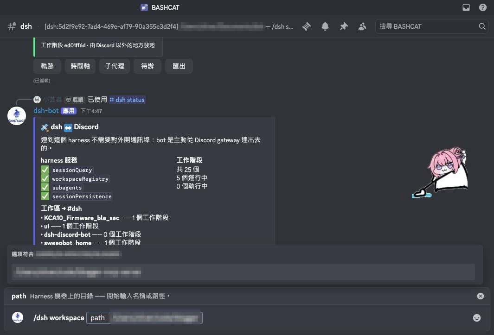
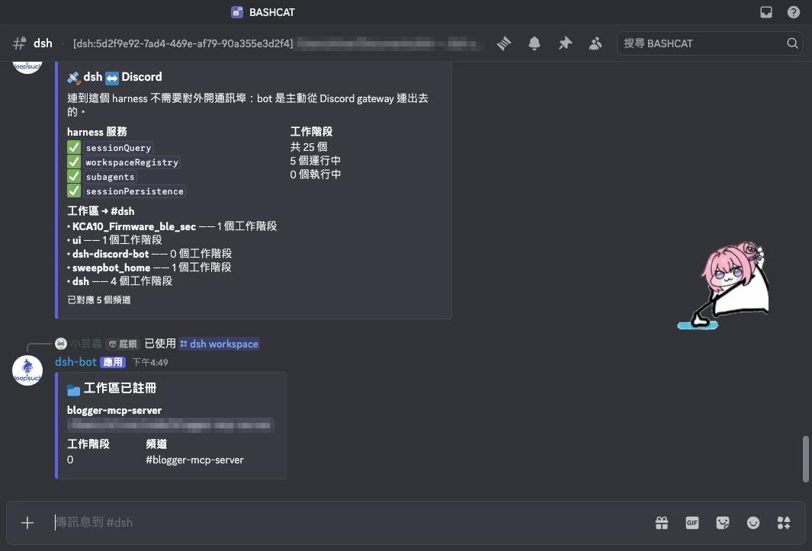
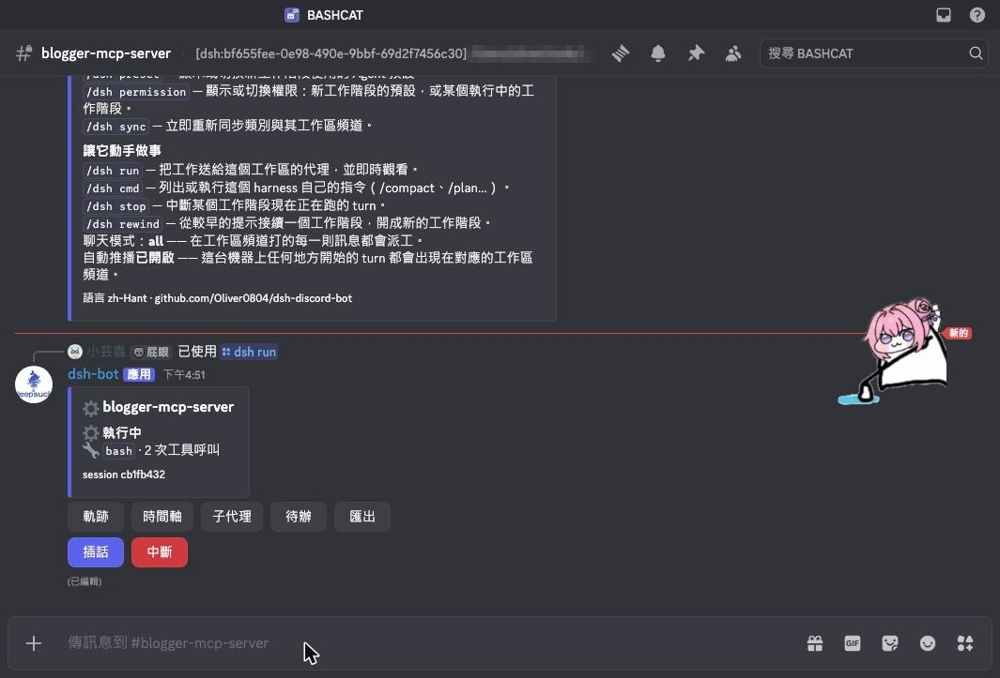
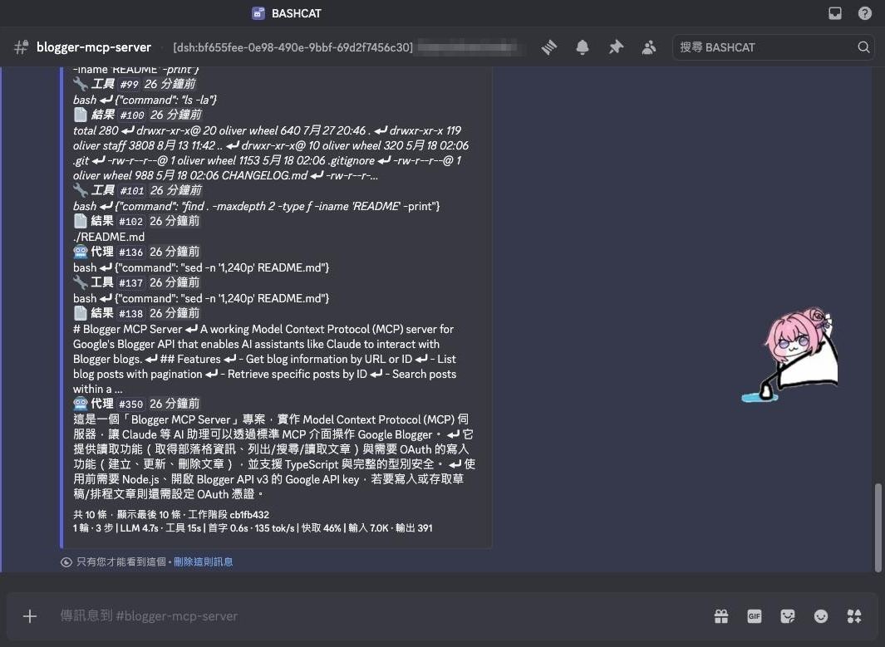
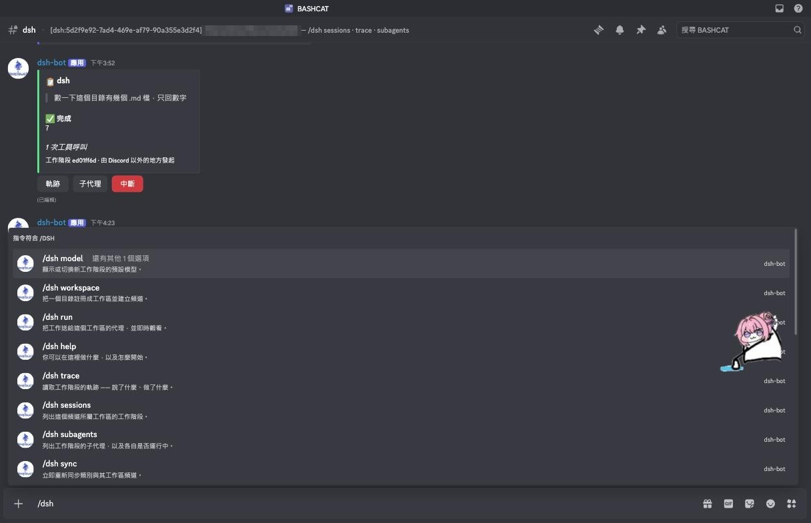
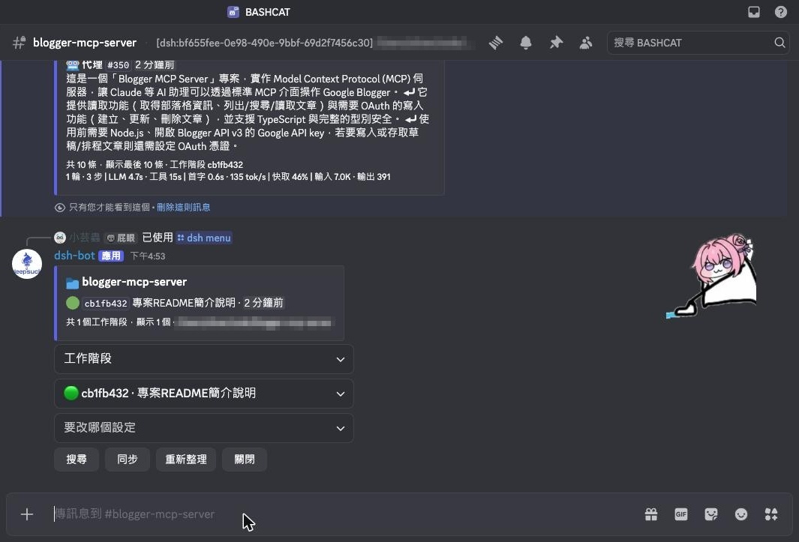

# dsh-discord-bot


English | [中文](README.zh.md)

Projects a [DeepSeek Harness](https://github.com/deepseek-ai/deepseek-harness) onto one Discord
guild: a category holding **one text channel per workspace**, and `/dsh …` commands that read
session trajectories and live subagents from inside those channels.

```
🗂 dsh                     ← the category
   # dsh                   ← workspace /Users/you/Documents/dsh
   # sweepbot-home         ← workspace /Users/you/code/game/godot/sweepbot_home
   # my-api                ← workspace /Users/you/work/my-api
```

| Register a workspace | The channel appears, private |
|---|---|
|  |  |
| **Send it work, watch the turn** | **Read back what actually happened** |
|  |  |

The bot answers in the language of whoever is clicking, so these are one guild's Traditional
Chinese — see [*Language*](#language). [More screenshots](docs/screenshots/).

## Reaching a machine you cannot route to

The bot opens a **WebSocket out** to Discord's gateway and keeps it open. Every command arrives
over that existing connection, so the harness answers from behind NAT, CGNAT, a hotel network, or
a corporate firewall — with **no port forwarded, no dynamic DNS, no reverse proxy, and no tunnel
service holding a key to your machine**. If the laptop can reach `discord.com`, you can query it
from your phone.

Nothing listens. There is no inbound attack surface to add.

## What it can and cannot do

**Reads** — sessions, trajectories, raw event timelines, subagents, lineage.

**Watches** — with `mirror: true`, every turn the harness runs appears in its workspace's channel as
it happens, whoever started it: the web UI, the tui, a cron entry. Off by default, because it
continuously exports session content to a chat platform.

**Writes** — register a workspace (`/dsh workspace`), and switch the default model (`/dsh model`),
the agent preset (`/dsh preset`) or the permission preset (`/dsh permission`).

**Runs work** — `/dsh run <prompt>` delivers a prompt to the workspace's agent and streams the turn
back. **This is off by default** (`allowRun: false`) because it is the one command that causes
work on your machine rather than describing it.

> **Read this before turning `allowRun` on.** With it enabled, everyone on `allowedUserIds` can
> make an agent edit files and run commands on the harness machine, from a phone. The allowlist
> stops being a privacy boundary and becomes a shell-access list. The bot does not weaken dsh's own
> sandbox or approval policy — whatever the harness would refuse locally it still refuses — but
> inside those limits, the agent acts. Keep the list to yourself, and prefer `ask` over
> `danger-full-access` as the permission preset if you enable this.

**Never** — it cannot bypass dsh's sandbox, approve on your behalf, or reach a session in another
workspace's channel.

## Channels are private

The category and its channels deny `@everyone` and grant only the bot and the people on
`allowedUserIds` — the guild owner alone when that list is empty. The same rule governs who may run
commands, so what a person can read and what they can ask never diverge.

Privacy is re-applied on **every** sync, not only at creation, so a category that already existed —
or one created before this was turned on — gets locked down rather than left as it is. If the bot
lacks *Manage Channels* it cannot restrict anything, and it says so loudly in the log and in
`/dsh sync` instead of leaving you to assume otherwise.

## Install

**1 — Create the bot.** At the [Discord Developer Portal](https://discord.com/developers/applications):
*New Application* → *Bot* → *Reset Token* and copy it. No privileged intents are needed — leave
Message Content **off**.

**2 — Invite it** to your server with the `bot` and `applications.commands` scopes:

```
https://discord.com/oauth2/authorize?client_id=<APP_ID>&permissions=268487696&scope=bot+applications.commands
```

That number is *View Channels*, *Send Messages*, *Embed Links*, *Attach Files*, *Manage Channels*,
and *Manage Roles*. The last one is the non-obvious one: writing channel permission overwrites —
what makes the channels private — requires Manage Roles, and Discord reports its absence only as a
bare "Missing Access". Without it the bot still works, but the channels stay world-readable and it
says so on every sync.

**3 — Install into a dsh profile.** The setup script installs the package, writes the token to
`$DSH_HOME/discord-bot.token` (mode 600), and appends a row to the profile's patch layer. It asks
for anything you do not pass, and refuses without touching the profile if a row already exists:

```bash
git clone https://github.com/Oliver0804/dsh-discord-bot
cd dsh-discord-bot
npm install
node bin/setup.js --profile web
```

The setup script packs the checkout into a tarball, installs that into the profile, writes the
token, and appends the plugin row — see *Development* for why it installs a tarball rather than
linking the directory.

Non-interactive:

```bash
node bin/setup.js --profile web --guild 123456789012345678 --token "$TOKEN" --yes
```

Add `--print` to see the row it would write without changing anything.

Then restart dsh:

```bash
dsh --profile web
```

Open the new **dsh** category and run `/dsh status`.

### Manual install

```bash
cd "${DSH_HOME:-$HOME/.dsh}/profiles/web"
pnpm add dsh-discord-bot
```

Append to that profile's `cordis.patch.yml`:

```yaml
- insert:
    - id: discord-bot
      name: 'dsh-discord-bot'
      config:
        guildId: '123456789012345678'
        tokenFile: '/Users/you/.dsh/discord-bot.token'
        categoryName: 'dsh'
```

The plugin belongs to the **host** plane, not an agent preset: it serves every workspace and every
session, so a per-session copy would be wrong (and would collide on the second session).

## Commands

Run these inside a workspace channel. The `session` option is autocompleted — pick from a list of
recent sessions instead of typing a uuid — and defaults to the newest session in that workspace.



| Command | Answers |
|---|---|
| `/dsh help` | What you can do here, and how to start. |
| `/dsh menu` | One card whose dropdowns do everything below, without typing. |
| `/dsh sessions [limit]` | Sessions in this workspace: title, live or cold, age. |
| `/dsh search <query> [limit]` | Full-text search across this workspace's sessions, ranked by the harness's own index. |
| `/dsh trace [session] [limit] [everything]` | The trajectory — what was asked, answered, and which tools ran. |
| `/dsh timeline [session] [limit]` | The raw event timeline plus a type histogram. |
| `/dsh subagents [session] [deep]` | Subagents and whether each is **running** or inactive. |
| `/dsh run <prompt>` | Send work to the workspace's agent and watch the turn. Needs `allowRun`. |
| `/dsh lineage [session]` | Ancestor and descendant sessions. |
| `/dsh model [to]` | Show the default model, or switch it (autocompleted from the provider catalog, falling back to the current model when the catalog is empty). |
| `/dsh todos [session]` | The todo list a running session is working through. |
| `/dsh context [session]` | The prompt sections, tools and skills that session actually has. |
| `/dsh export [session]` | The whole trajectory as a Markdown attachment. |
| `/dsh cmd [name] [input]` | List or run **this harness's own commands** — `/compact`, `/plan`, whatever the deployment registers. Running one needs `allowRun`. |
| `/dsh stop [session]` | Interrupt the turn a session is running right now. Needs `allowRun`. |
| `/dsh rewind [session]` | Continue from an earlier prompt, in a new session. Needs `allowRun`. |
| `/dsh preset [to]` | Show or switch the agent preset new sessions are composed from. Switching needs `allowRun`. |
| `/dsh permission [to] [session]` | Show or switch permissions: the default for new sessions, or one running session. Switching needs `allowRun`. |
| `/dsh workspace <path>` | Register a directory as a workspace and give it a channel (path is autocompleted). |
| `/dsh status` | Mounted services, session counts, the workspace list, and how many channels are mapped. |
| `/dsh sync` | Re-sync the category, its channels, and their privacy now — and file any session sitting in a registered workspace's directory that nothing had attached to it. |

`trace` reads the harness's own semantic-document projection, so reasoning blocks, stream chunks,
and structural boundaries are already filtered out. `everything: true` keeps the rest. Any answer
too large for one message spills into an attached `.txt` rather than being silently truncated.

`model` changes the deployment default, which applies to sessions created **from then on**; a
running session keeps the model it was created with. dsh's `saveSelection` is a silent no-op when
a profile has no settings provider, so the write is read back and a switch that did not persist is
reported as a failure rather than as success.

`workspace` takes an absolute path to an existing directory *on the harness machine* and syncs
immediately, so the new channel appears in the same breath. Its `path` is autocompleted against the
real filesystem — type a partial path to walk it, or a bare name to match directories sitting
alongside workspaces the harness already knows. Typing a full path on a phone is not a reasonable
thing to ask, and the harness resolves nothing relative to Discord.

Autocomplete answers only for people on the allowlist. Session titles and directory names are real
information about the machine, so the hints are gated exactly like the commands.

### Running work, and approvals

`run` continues the workspace's newest session — unless an older one is still live, because a
workspace never runs two agents at once. A live agent is used as-is, a cold one is resumed (with
the model selection and preset reinstalled, see below), and a workspace with no session yet gets a
fresh one rooted at its directory. Each run also files the session under the workspace in dsh's
registry, so it shows up in that workspace's channel instead of under "Ungrouped".

Sessions started anywhere else are filed by `/dsh sync`, which attaches any session whose cwd is
**exactly** a registered workspace's directory and that nothing had attached yet. The exactness
matters: `/a/b` is a parent of `/a/b/sub`, so a looser match would file a subproject's sessions
under its parent. Without this, dsh's own sidebar can show a workspace as empty while listing its
sessions under "Ungrouped" — this bot reads through a cwd fallback and looks fine, so the two
surfaces disagree about the same corpus.

The turn is reported by rewriting one message every few seconds — Discord allows about five
messages per five seconds per channel, and a busy turn emits hundreds of events. Reasoning blocks
are dropped from the live view; `/dsh trace` has the full record afterwards.

That card carries buttons while it runs: **Trace**, **Timeline**, **Subagents**, **Todos** and
**Export** answer privately with the same views the slash commands return. With `allowRun` on a
second row adds **Steer** — a modal that delivers a message at the turn's next step boundary — and
**Stop**, which is two-step: the first tap arms Confirm/Cancel so a phone in a pocket cannot
interrupt work by accident. The buttons are stateless, so a card left in scrollback still works
after a restart.

`runVerbosity` decides what that message says. The default, `minimal`, shows one line naming the
tool in flight while it works, then the agent's closing words and a tool count when it lands — the
answer, not the process. `full` keeps the running transcript for when you are watching *how* a turn
works rather than waiting for what it concluded.

Resuming a cold session restores the conversation but not the agent: the model selection and the
preset that supplies its tools have to be reinstalled. This package does both. Skipping the preset
produces the most confusing failure available — the model, having no tool schemas, writes tool calls
as prose and nothing executes them.

When the harness asks for approval during such a turn, the bot posts a card with **Allow once** and
**Deny**, and three rules govern it:

- By default it answers **only** for turns started from Discord, so a session you are driving in the
  web UI keeps being answered there. `mirrorApprovals: true` opts into the other posture — see
  *Watching work you did not start*.
- The clicker is checked against `allowedUserIds` — seeing the channel is not permission to approve.
- If nobody answers within two minutes it hands the question back to dsh rather than deciding.
  Timing out is not consent, and it is not refusal either.

### Chat mode

With `listenToMessages`, an ordinary message in a workspace channel becomes work — no slash command:

| Value | Behaviour |
|---|---|
| `off` *(default)* | Messages are ignored entirely; only `/dsh run` works. |
| `mention` | A message that @-mentions the bot is treated as a prompt. |
| `all` | Every message in a workspace channel is a prompt. A line that starts with `/` is ignored — it would otherwise collide with the command surface. |

Chat mode also requires `allowRun`, and it needs the **Message Content** privileged intent, which
you must enable first under *Bot → Privileged Gateway Intents* in the Developer Portal. Discord
refuses the entire connection when an application requests an intent it has not enabled, so the bot
only asks for it when this is set — and if it is refused anyway, the bot stops and says which of the
two fixes applies instead of retrying forever.

Declined messages are ignored silently. This handler sees every message in the guild, so answering
the ones it rejects would turn ordinary conversation into a stream of refusals — and telling an
unauthorized member that they are unauthorized only advertises that the bot is worth probing.

### Reaching the rest of the harness

Six of the commands above exist because a harness is more than its session log,
and most of what it can do is reachable without this package knowing what it is.

**`/dsh cmd` is the escape hatch.** `dsh-commands` is where the harness and its
plugins publish human commands, so listing the registry gives whatever this
deployment actually has — `/compact`, `/plan`, `/goal`, and anything installed
later — instead of a hard-coded set that goes stale. Execution goes through the
registry's own executor, which writes the paired `command/run` and
`command/done` records and resolves the handler through the agent's scope. That
last part is what makes `/dsh cmd compact` work at all: the shipped presets
isolate the compaction service inside their own realm, where `ctx.get(…)` from
the host plane returns nothing. Anything this bot reads *about a session* now
resolves the same way — the agent first, the host plane second.

**Typing while it works steers instead of queueing.** If a turn is already
running — started here, or at the machine — a new prompt is delivered at that
turn's next step boundary rather than queued behind it as a whole new turn,
which is what interrupting a conversation means. The reply says so and stops
there: that turn belongs to whoever started it, and the mirror is already
reporting it. Steering is still work, so it needs `allowRun` like everything
else that reaches an agent — chat mode included.

**`/dsh stop` is the kill switch.** A turn heading somewhere wrong can be
interrupted from a phone, including one started at the machine. Queued and
steering input goes with it, because a cancel that left the queue armed would
restart the work it just stopped.

**`/dsh rewind` forks without leaking.** Pick an earlier prompt from the menu
and the conversation continues as a *new* session that stops just before it; the
original is untouched. The seed is sliced from the live log rather than taken
from `sessions.fork()` — that call creates a live child session in the store,
and since `agents.create` must own the session it drives, using it would abandon
one session per rewind.

**Files dropped into a channel become context.** In chat mode, text attachments
on a message are read and appended to the prompt they came with — the typed text
stays first, which is what the transcript shows. Only the message's own Discord
CDN attachments are fetched (never a URL from the text), only textual types, at
most five files and 100 KB each.

### Watching work you did not start

Everything above is a pull: you ask, the bot reads. `mirror: true` adds the other direction. The
plugin subscribes to the harness's own append feed — which reaches an unscoped listener for *every*
session, not just the ones this bot created — and reports each turn into the channel its workspace
maps to.

The shape is the same one `/dsh run` uses, and deliberately so: **one message per turn, rewritten
every few seconds** until the turn closes. Per-event posting cannot survive Discord's five-messages-
per-five-seconds channel budget, and a card you can watch beats a wall you have to scroll. The card
carries the same read buttons as a driven run, plus **Steer** and two-step **Stop** when `allowRun`
is on, so a turn started at the machine can still be inspected, steered, or interrupted from a phone.

- A session is placed by the same union the commands read: the workspace's registry account, or its
  cwd when the registry has not filed it yet.
- **Subagents are excluded** unless `mirrorSubagents: true`. One turn can fan out to a dozen of them,
  all sharing the parent's directory, and they would drown the channel they land in.
- A turn this bot itself started is **not** mirrored — `runTurn` already reports it into the reply
  that started it.
- A turn whose workspace has no channel yet is **held**, not dropped, until `followNewWorkspaces`
  reconciles one into existence (two minutes, then it is given up on).
- **There is no backfill.** Events appended while the bot was offline are gone from the mirror's
  point of view; `/dsh trace` still has them, because that reads the log rather than the feed.

`mirrorApprovals: true` extends the approval card to sessions this bot did not start, which is what
makes a phone enough to unblock work begun at the machine. The tradeoff is real and worth stating:
while that card is pending, a person sitting at the web UI sees no prompt for up to two minutes —
the answerer is a waterfall, and this bot has claimed the question. It stays off by default for that
reason.

The full two-way setup, with the caveats above accepted:

```yaml
config:
  mirror: true            # harness → Discord: every turn, as it happens
  mirrorApprovals: true   # approvals for sessions started anywhere
  allowRun: true          # Discord → harness: /dsh run
  listenToMessages: all   # Discord → harness: plain messages are prompts
```

### Answering the model's questions

`ask_user_question` parks a tool call until a human answers. Unlike approvals,
that seam takes **exactly one provider** and throws on the second — so
`answerQuestions` is off by default and is not merely a try/catch: in a web
profile `dsh-host-apiproxy` owns the seam and the person at the browser is the
one watching for that questionnaire.

The seam is claimed **after** the bot connects to Discord, never at activation,
and that ordering is load-bearing rather than tidy: a plugin row in the patch
layer is applied *before* the bundles it sits after, so claiming it at
activation makes `dsh-host-apiproxy` fail its own registration and **the whole
harness refuses to boot**. Waiting until the gateway is up puts this bot last in
line — wherever a UI owns the seam it has already taken it and this one declines.

Declining used to end it, which left the case this bot exists for unserved: a
turn that stops to ask a question stops until somebody is at the browser. So a
bot that loses the seam goes in the other way. It is a plugin inside the same
cordis context as the gateway, which makes `ctx.apiProxy` — the very object the
browser talks to over HTTP — a direct call from here, with no port, no
credentials and no second carrier. Subscribing to its event stream yields the
same pending questions the web UI renders, and answers go back through the same
entry point the web UI uses.

**Both surfaces stay live.** The gateway removes a pending question before
settling it, so whoever answers first wins and the other card retracts itself —
answer on your phone or at the browser, whichever you reach. What this mode
never does is decide anything: it does not own the ask, so an unanswered card
expires quietly and says the question is still waiting in the web UI. Cancelling
would settle a question someone may be reading right now.

With it on, each question arrives as a card with a menu, gated by the same
allowlist. If the question has options you can pick one; either way a
**✍️ Custom answer** button opens a modal for free text, so an open-ended
question is answerable too. An unanswered card **rejects** the ask after fifteen
minutes — there is no `next()` to hand it back with, and a tool call blocked
forever is worse than one that was cancelled.

### The menu card

`/dsh menu` posts one card that covers the command surface without typing — which matters on the
machine this bot exists to be used from. Five rows: what to look at, which session, which setting to
change, that setting's options, and a row with **Search** (opens a modal), **Sync**, refresh and
close.



The card holds **no server-side state**. The view, the selected session and the open picker are
encoded into its own components' ids and read back on the next click, so a card posted yesterday
still works after a restart — the message *is* the state. Reading is open to anyone on the
allowlist; the preset and permission pickers are disabled unless `allowRun` is set, because those
two decide what a later turn may do.

### Language

Replies come in English, Traditional Chinese or Simplified Chinese. `language: auto` (the default)
follows the locale of whoever ran the command, which is the closest a shared channel message gets to
per-viewer text; set it explicitly to pin one language for everyone.

Command names and descriptions are localized by **Discord itself**, so the picker is always in each
person's own client language regardless of this setting — that surface is private to the reader,
while a reply is one message everyone in the channel sees.

`/dsh trace` and `/dsh timeline` carry the session's whole-log statistics in their footer — turns,
steps, LLM and tool time, time to first token, decode rate, cache hit, and token counts. These are
dsh's own folded figures, the same ones the web chat's stats strip renders, so paging and compaction
cannot change them.

## Configuration

| Key | Default | Meaning |
|---|---|---|
| `guildId` | *required* | The one guild this bot serves. Interactions elsewhere are ignored. |
| `token` | — | Bot token inline. Prefer `tokenFile`. |
| `tokenFile` | — | File whose first non-comment line holds the token. |
| `categoryName` | `dsh` | Category that holds the workspace channels. |
| `allowedUserIds` | `[]` | Discord user ids allowed to query. **Empty means the guild owner alone.** |
| `manageChannels` | `true` | Whether the bot may create and rename the category and channels. |
| `privateChannels` | `true` | Deny `@everyone` and grant only the bot and `allowedUserIds`. |
| `allowRun` | `false` | Enable `/dsh run`. **Grants the allowlist agent execution on this machine.** |
| `listenToMessages` | `off` | `off` / `mention` / `all` — treat channel messages as prompts. Needs `allowRun` and the Message Content intent. |
| `runVerbosity` | `minimal` | `minimal` shows the answer; `full` streams the whole transcript. |
| `language` | `auto` | `auto` / `en` / `zh-Hant` / `zh-Hans` — the language replies are written in. |
| `mirror` | `false` | Post every turn the harness runs into its workspace's channel, whoever started it. **Exports session content continuously.** |
| `mirrorSubagents` | `false` | Include subagent sessions in the mirror. One turn can fan out to a dozen. |
| `mirrorNewSessions` | `true` | Announce a newly created session in its channel. Only applies while `mirror` is on. |
| `mirrorApprovals` | `false` | Answer approval questions for sessions this bot did not start. **A web-side user then waits out the card's two minutes.** |
| `answerQuestions` | `false` | Answer `ask_user_question` from Discord. Claims the seam where it is free; where a UI owns it, mirrors the gateway's questions instead so **both surfaces can answer and the first one wins**. |
| `followNewWorkspaces` | `true` | Create a channel when a session appears for an unmapped workspace. |
| `traceLimit` | `25` | Default entries per `/dsh trace` — also the default per `/dsh timeline`. |
| `sessionLimit` | `15` | Default sessions per `/dsh sessions`. |
| `retrySeconds` | `30` | Delay between Discord login retries. |

The token may also come from `DSH_DISCORD_BOT_TOKEN` or `DISCORD_BOT_TOKEN`. Precedence is
`token` → `tokenFile` → environment.

## Security

- **One guild.** Interactions from any other guild are dropped before authorization runs.
- **Allowlist.** An empty `allowedUserIds` authorizes the guild owner only — never the whole
  server. Add ids to widen it deliberately. The same list gates channel visibility.
- **Private channels by default.** `@everyone` is denied; only the bot and the allowlist can read.
- **No privileged intents.** Only `Guilds`. The bot cannot read anyone's messages.
- **Session text is neutralized** before it enters a message: code fences cannot break out and
  mentions cannot ping the server.
- **No execution unless you ask for it.** `allowRun` is off by default; with it off, nothing here
  can run a command or drive an agent. With it on, the allowlist is a shell-access list — see the
  warning at the top.
- **Approval is never automatic.** The bot cannot approve on your behalf, and a card that times out
  is handed back to dsh rather than decided.
- **Mirroring is opt-in.** With `mirror` off — the default — nothing reaches a channel unless
  someone asks for it. With it on, every session's conversation is continuously exported to Discord,
  including work started at the machine by someone who never chose that.
- **`/dsh cmd`, `/dsh stop` and `/dsh rewind` need `allowRun`.** Each one either
  causes work, ends work someone at the machine may be watching, or mints an
  agent — none of them are reads, and none are available with `allowRun` off.
- **Attachments are read from Discord's CDN only**, never from a URL in the
  message text, only for textual types, and capped at five files of 100 KB.
- **Switching preset or permission needs `allowRun`.** Neither runs anything itself, but both decide
  what a later turn may do — which tools it is composed with, and whether its commands are sandboxed
  or approved — so widening them is gated like execution, not like a read.

### Where the token lives

The token belongs in `$DSH_HOME/discord-bot.token`, written mode 600 by the setup script — never in
this repository and never in a committed profile. `.gitignore` blocks `.env`, `*.token`, and
`*.secret` as a backstop, but the real protection is that the file lives outside the tree entirely.
The plugin row references it by path.

If a token is ever pasted into a shell, a chat, or a commit, treat it as burned: reset it in the
Developer Portal and rewrite the token file. A leaked bot token lets anyone read every channel the
bot can see.

### If the category already exists and is already private

A fresh install needs no manual permission work: the bot creates the category itself and writes its
own access in at creation, so the category is private, the bot can see it, and every channel under
it inherits both.

The one case that breaks is a category that was **made private by hand before the bot was
introduced**, with no exception for the bot. The bot is then locked out of the channel tree it is
supposed to manage — it cannot restrict channels, cannot create new ones there, and cannot receive
messages for chat mode. Slash commands still work, because an interaction carries its own token.

The invite URL cannot fix this. `permissions=` grants guild-level permissions, and a channel
overwrite beats a guild-level permission; the only thing that bypasses overwrites is
`Administrator`, which is far too much to hand a bot for this. Pick one instead:

- **Grant it once** — category → *Edit Category* → *Permissions* → add the bot, allow *View
  Channel*. Existing channels and their history are kept, and the bot takes over from there.
- **Let the bot start clean** — point `categoryName` at a name that does not exist yet, and the
  next sync builds a correct one. The old channels stay where they are.

After either, `/dsh sync` reports `🔒 private` without the "set outside the bot" note, which is how
you know the bot is managing it rather than merely observing it.

## Behaviour worth knowing

- **A failure never takes dsh down.** A bad token, a revoked permission, or no network logs a
  warning and retries; the harness boots and runs regardless. This matters because Cordis treats an
  activation throw as a failed composition — `dsh-host-webserver` genuinely stops the process when
  its port is taken, and a chat bridge must not behave that way.
- **Channels are never deleted.** A workspace removed from dsh leaves its channel and history in
  place; `/dsh status` reports the leftovers.
- **The mapping lives in the channel topic** (`[dsh:<workspaceId>] …`), not in memory, so it
  survives restarts and channel renames. Clear the topic to unmap a channel.
- **Discord caps a category at 50 channels.** Beyond that, workspaces stay unmapped and the
  overflow is logged rather than silently dropped.
- **Without `ctx.workspaceRegistry`** — the tui and headless profiles do not mount it — workspaces
  are grouped by session `cwd` instead. Everything else works the same.
- **Upgrading the package needs a dsh restart.** dsh's HMR reloads the *composition*, so adding the
  plugin row activates the bot in a running harness without one — but Node has already cached the
  module, so a later `pnpm add` of a new version does not take effect until the process restarts.
  A harness left running will keep answering with the version it first loaded.
- **Never run two harnesses on one bot token.** Discord delivers each interaction to exactly one
  connected session, so two instances answer at random: half the commands hit the older build and
  the other half fail with "Unknown interaction". Give a second harness its own bot application.

## Requirements

- dsh `0.1.0-rc.6` or newer, with `sessionQuery` composed (every profile built on `dsh-base` has it)
- Node.js 20+

## Development

**There is no build step.** The package ships the JavaScript it runs: plain ESM, no TypeScript, no
bundler, no transpile. `lib/` is the source and the published artifact both, so what you read is
what executes inside dsh.

```bash
git clone https://github.com/Oliver0804/dsh-discord-bot
cd dsh-discord-bot
npm install       # discord.js only
npm test          # 76 unit tests — no network, no harness, no Discord account
```

Layout:

| File | Role |
|---|---|
| `lib/index.js` | Cordis plugin entry: lifecycle, connection, retry, logging |
| `lib/config.js` | Config validation and token resolution |
| `lib/workspaces.js` | Workspace view — registry, or cwd grouping as fallback |
| `lib/queries.js` | Every harness read, and the four writes |
| `lib/render.js` | Discord embeds, size limits, attachment overflow |
| `lib/topology.js` | Category/channel reconciliation and privacy |
| `lib/commands.js` | Slash command definitions |
| `lib/router.js` | Interaction routing, authorization, autocomplete |
| `lib/mirror.js` | The push side: buffering, one message per turn, the call budget |
| `lib/activity.js` | Who is working right now, from `agent/status` |
| `lib/scope.js` | Reading services that live inside an agent's preset realm |
| `lib/questions.js` | The question card, and the `ask_user_question` provider when this bot claims the seam |
| `lib/questions-mirror.js` | The same card driven through `ctx.apiProxy`, when a UI owns the seam |
| `lib/attachments.js` | Channel files, read into prompt content blocks |
| `lib/routing.js` | Session → workspace → channel, cached, shared with approvals |
| `lib/menu.js` | The `/dsh menu` card and its stateless components |
| `bin/setup.js` | Installer |

To test against a live harness without touching your own profile, install the packed tarball and
boot a second instance with an overlay patch on another port:

```bash
npm pack
(cd "${DSH_HOME:-$HOME/.dsh}/profiles/web" && pnpm add /path/to/dsh-discord-bot-0.1.0.tgz)
dsh --profile web --patch ./my-test-patch.yml --port 3099
```

Install the packed tarball rather than linking the source directory: a linked package resolves its
own `node_modules`, which would bind the plugin against a **second copy** of the harness's packages
— a different class identity than the host holds, and a failure that surfaces as a plugin that
silently never registers. This package imports nothing from `@deepseek-ai/*` for the same reason;
its only contact with the harness is the `ctx` object handed to `apply`.

## License

MIT — see [LICENSE](LICENSE).
